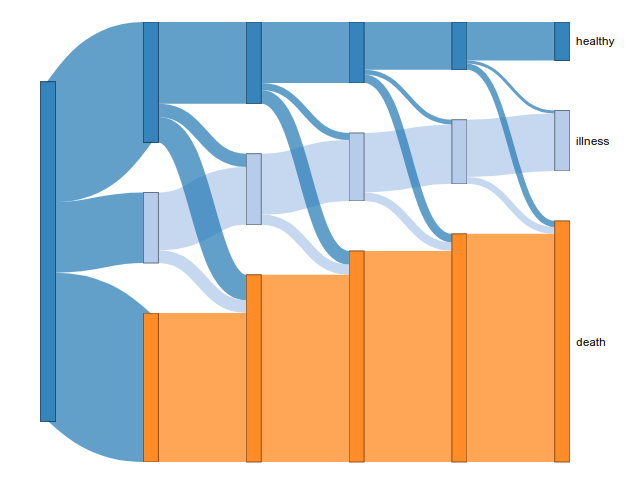

<!-- README.md is generated from README.Rmd. Please edit that file -->
[](https://cran.r-project.org/package=multistateutils) [](https://travis-ci.org/stulacy/multistateutils) [](https://codecov.io/github/stulacy/multistateutils?branch=master) [](https://zenodo.org/badge/latestdoi/126024410) [](http://joss.theoj.org/papers/67db63fbfec0d7b9aacc672bb37e2173)

multistateutils
===============

`multistateutils` provides a number of useful functions for analyzing parametric multi-state models. In this way it does not aim to supplement the modelling strategies found in `mstate`, `msm`, or `flexsurv`, but rather provide tools for subsequent analysis. It is designed to be used with semi-Markov multi-state models of healthcare data, but can be used for any system that can be discretized into the states being entered at observed time-points, with parametric families providing appropriate fits for these transition rates.

It currently provides several features:

-   Estimate transition probabilities
-   Estimate length of stay
-   Draw predicted pathways through the state space with dynamic prediction

Examples of these features are provided below in *Examples*.

Installation
------------

You can install the latest release version from CRAN with:

``` r
install.packages("multistateutils")
```

Or the development version can also be installed directly from GitHub.

``` r
install.packages("devtools")  # install devtools if it isn't already
devtools::install_github("stulacy/multistateutils", build_vignettes=TRUE)
```

Examples
--------

This section provides a brief overview of the features in `multistateutils`, please see the *Examples* vignette for a thorough description.

### Setup

In these examples we'll use the `ebmt3` data set provided in the `mstate` package. It describes recovery after bone marrow transplant. We'll model it with an illness-death model, with *transplant* as the starting state, platelet recovery *pr* as the illness state, and relapse-free survival *rfs* as the death state.

``` r
library(mstate)
#> Loading required package: survival
data(ebmt3)
tmat <- trans.illdeath()                             # Form transition matrix
long <- msprep(time=c(NA, 'prtime', 'rfstime'),      # Convert data to long
               status=c(NA, 'prstat', 'rfsstat'), 
               data=ebmt3, 
               trans=tmat, 
               keep=c('age', 'dissub'))
head(long)
#> An object of class 'msdata'
#> 
#> Data:
#>   id from to trans Tstart Tstop time status age dissub
#> 1  1    1  2     1      0    23   23      1 >40    CML
#> 2  1    1  3     2      0    23   23      0 >40    CML
#> 3  1    2  3     3     23   744  721      0 >40    CML
#> 4  2    1  2     1      0    35   35      1 >40    CML
#> 5  2    1  3     2      0    35   35      0 >40    CML
#> 6  2    2  3     3     35   360  325      1 >40    CML
```

`multistateutils` is designed for applied modelling with an overall aim of prediction, particularly in health-related areas. For this reason it is designed to work with parametric transition models built with `flexsurv`. The example below fits a Weibull model to each transition using the `age` and `dissub` covariates.

``` r
library(flexsurv)
models <- lapply(1:3, function(i) {
    flexsurvreg(Surv(time, status) ~ age + dissub, data=long, dist='weibull')
})
```

Estimating transition probabilities
-----------------------------------

Transition probabilities are defined as the probability of being in a state *j* at a time *t*, given being in state *h* at time *s*, as shown below where *X*(*t*) gives the state an individual is in at *t*. This is all conditional on the individual parameterised by their covariates and history, which for this semi-Markov model only influences transition probabilities through state arrival times.

*P*<sub>*h*, *j*</sub>(*s*, *t*)=Pr(*X*(*t*)=*j* | *X*(*s*)=*h*)

We'll estimate the transition probabilities of an individual with the covariates `age=20-40` and `dissub=AML` at 1 year after transplant.

``` r
newdata <- data.frame(age="20-40", dissub="AML")
```

``` r
library(multistateutils)
predict_transitions(models, newdata, tmat, times=365)
#>     age dissub start_time end_time start_state   healthy   illness
#> 1 20-40    AML          0      365     healthy 0.4689727 0.1960009
#> 2 20-40    AML          0      365     illness 0.0000000 0.6860803
#> 3 20-40    AML          0      365       death 0.0000000 0.0000000
#>       death
#> 1 0.3350264
#> 2 0.3139197
#> 3 1.0000000
```

This functionality is already provided in `flexsurv::pmatrix.simfs`, but it is limited to assessing only one individual at a time, with *s* = 0

``` r
pmatrix.simfs(models, tmat, newdata=newdata, t=365)
#>         [,1]    [,2]    [,3]
#> [1,] 0.47134 0.19118 0.33748
#> [2,] 0.00000 0.68671 0.31329
#> [3,] 0.00000 0.00000 1.00000
```

`predict_transitions` on the other hand can estimate transition probabilities for:

-   Multiple individuals
-   Multiple values of *t*
-   Multiple values of *s*
-   Any combination of the above, all from the same simulation
-   A mixture of distributions for the transition models

The ability to generate probabilities by varying *s* and *t* within a single simulation makes it very efficient for generating dynamic predictions.

``` r
predict_transitions(models, newdata, tmat, times=c(1, 2)*365, 
                    start_times = c(0.25, 0.75) * 365)
#>      age dissub start_time end_time start_state   healthy    illness
#> 1  20-40    AML      91.25      365     healthy 0.6985782 0.11827607
#> 2  20-40    AML      91.25      365     illness 0.0000000 0.83396061
#> 3  20-40    AML      91.25      365       death 0.0000000 0.00000000
#> 4  20-40    AML      91.25      730     healthy 0.5242891 0.16199645
#> 5  20-40    AML      91.25      730     illness 0.0000000 0.72123949
#> 6  20-40    AML      91.25      730       death 0.0000000 0.00000000
#> 7  20-40    AML     273.75      365     healthy 0.9110012 0.03866656
#> 8  20-40    AML     273.75      365     illness 0.0000000 0.95100475
#> 9  20-40    AML     273.75      365       death 0.0000000 0.00000000
#> 10 20-40    AML     273.75      730     healthy 0.6837145 0.11511125
#> 11 20-40    AML     273.75      730     illness 0.0000000 0.82027680
#> 12 20-40    AML     273.75      730       death 0.0000000 0.00000000
#>         death
#> 1  0.18314573
#> 2  0.16603939
#> 3  1.00000000
#> 4  0.31371445
#> 5  0.27876051
#> 6  1.00000000
#> 7  0.05033220
#> 8  0.04899525
#> 9  1.00000000
#> 10 0.20117429
#> 11 0.17972320
#> 12 1.00000000
```

Length of stay
--------------

Similarly, the length of stay functionality provided by `flexsurv::totlos.simfs` has also been extended to allow for estimates at multiple time-points, states, and individuals to be calculated simultaneously. As shown below, the function parameters are very similar and the estimates are very close to those produced by `totlos.simf`.

``` r
length_of_stay(models, 
               newdata=newdata,
               tmat, times=365.25*3,
               start=1)
#>     age dissub       t start_state  healthy  illness    death
#> 1 20-40    AML 1095.75     healthy 486.1548 206.5854 403.0098
```

``` r
totlos.simfs(models, tmat, t=365.25*3, start=1, newdata=newdata)
#>        1        2        3 
#> 485.7349 208.9578 401.0573
```

Again, the advantage of this implementation is that estimates can be produced from multiple conditions without needing to rerun the simulation.

``` r
length_of_stay(models, 
               newdata=data.frame(age=c(">40", ">40"),
                                  dissub=c('CML', 'AML')),
               tmat, times=c(1, 3, 5)*365.25)
#>   age dissub       t start_state   healthy   illness     death
#> 1 >40    CML  365.25     healthy 104.25817  30.42421  47.94261
#> 2 >40    AML  365.25     healthy  97.19763  31.91332  53.51405
#> 3 >40    CML 1095.75     healthy 220.66324 106.02685 221.18490
#> 4 >40    AML 1095.75     healthy 198.67109 106.30842 242.89549
#> 5 >40    CML 1826.25     healthy 294.19977 178.76934 440.15589
#> 6 >40    AML 1826.25     healthy 259.80226 174.01172 479.31102
```

State flow diagram
------------------

Another feature in `multistateutils` is a visualization of a predicted pathway through the state transition model, calculated using *dynamic prediction* and provided in the function `plot_predicted_pathway`. It estimates state occupancy probabilities at discrete time-points and displays the flow between them in the manner of a Sankey diagram as shown below.

The output of this function is an interactive HTML widget that can be manipulated to layout the diagram to better suit your needs. Unfortunately widgets can't be embedded in GitHub READMEs so the image below is just a screenshot, but have a look at the version in the vignette for an working example.

*P*<sub>*h*, *j*</sub>(*s*, *t*)=Pr(*X*(*t*)=*j* | *X*(*s*)=*h*)

``` r
time_points <- seq(0, 10, by=2) * 365.25
plot_predicted_pathway(models, tmat, newdata, time_points, 'healthy')
```



Discrete event simulation
-------------------------

The underlying simulation engine can be easily adapted to run cohort-wide simulation, where the output statistics of interest are global rather individual level measures. This is useful for estimating healthcare related values, such as the average time spent receiving treatment for a given disease population.

These discrete event simulations are run with the `cohort_simulation` function as below. They simply require a list of models as specified above, a cohort population, and the transition matrix. It outputs a long table where each row is an observed state entry for a given individual.

``` r
sim <- cohort_simulation(models, ebmt3, tmat)
head(sim)
#>   id   age dissub   state time
#> 1  0   >40    CML healthy    0
#> 2  2   >40    CML healthy    0
#> 3  6 20-40    CML healthy    0
#> 4 14   >40    CML healthy    0
#> 5 30  <=20    ALL healthy    0
#> 6 62  <=20    ALL healthy    0
```

By default the simulation runs until every individual reaches a sink state, but a longitudinal specification can be provided, such that the individuals enter the simulation at set incident times and the simulation terminates after a predefined period. This functionality is useful when estimating statistics over a finite time-period, such as the expected number of deaths in a 5-year range, but it requires a model of the incidence process (i.e. how often a new patient is diagnosed). See the *Examples* vignette for further details.

`msprep2`
---------

A large part of the work involved with multi-state modelling is basic munging of the data into a format suitable for modelling. The `msprep` function from the `mstate` package helps a lot here by converting a wide data frame where each row corresponds to a user with state entry times given in column, into a long format where each row represents a possible state transition.

It does, however, have some slight limitations:

-   Having to form a wide table in the first place with an entry time and status indicator for each state can be a bit time consuming and isn't necessarily a natural way of storing such data
-   This wide format only allows an individual to enter a state once
-   For censored state transitions it can be awkward having to replicate the censoring time for each non-visited state

For these reasons I've created a modified version of `msprep`, imaginatively called `msprep2`, that performs the same role but accepts the input data as a tidy table of state entry times rather than a wide table at the individual level.

In this format, each row in the input data frame corresponds to a known state entry time, and so non-visited states are simply omitted. The input data frame only needs 3 columns: an individual id, a state id, and the time of entry. Covariates and censoring information are provided by separate data frames that link back on the id, providing a cleaner interface and one that works well with data that is stored in relational databases.

The example below shows the data preparation for 2 individuals:

1.  Enters state 2 at *t* = 23 then no more transitions until last follow-up at *t* = 744
2.  Enters state 2 at *t* = 35 then enters the absorptive state 3 at *t* = 360

``` r
entry <- data.frame(id=c(1, 2, 2),
                    state=c(2, 2, 3),
                    time=c(23, 35, 360))
cens <- data.frame(id=1, censor_time=744)
covars <- data.frame(id=1:2, age=c('>40', '20-40'), dissub=c('CML', 'AML'))
msprep2(entry, tmat, censors = cens, covars = covars)
#> # A tibble: 6 x 10
#>      id  from    to trans Tstart Tstop  time status age   dissub
#>   <int> <int> <int> <int>  <dbl> <dbl> <dbl>  <int> <fct> <fct> 
#> 1     1     1     2     1      0    23    23      1 >40   CML   
#> 2     1     1     3     2      0    23    23      0 >40   CML   
#> 3     1     2     3     3     23   744   721      0 >40   CML   
#> 4     2     1     2     1      0    35    35      1 20-40 AML   
#> 5     2     1     3     2      0    35    35      0 20-40 AML   
#> 6     2     2     3     3     35   360   325      1 20-40 AML
```

By specifying state entry as a long table there is now no limit to how many times a state can be entered by an individual. Let's demonstrate this by extending the illness-death model to allow a patient to recover (i.e. transition from illness back to healthy).

``` r
states <- c('healthy', 'illness', 'death')
tmat2 <- matrix(c(NA, 3, NA, 1, NA, NA, 2, 4, NA), nrow=3, ncol=3, 
                dimnames=list(states, states))
tmat2
#>         healthy illness death
#> healthy      NA       1     2
#> illness       3      NA     4
#> death        NA      NA    NA
```

I'll create a dummy dataset with one individual moving from healthy-&gt;illness-&gt;death at times 6 and 11, while patient 2 goes from healthy-&gt;illness, then is cured and goes back to healthy, before moving back to illness and finally dying.

``` r
multistate_entry <- data.frame(id=c(rep(1, 2),
                                    rep(2, 4)),
                               state=c('illness', 'death',
                                       'illness', 'healthy', 'illness', 'death'),
                               time=c(6, 11,
                                      7, 12, 17, 22))
multistate_entry
#>   id   state time
#> 1  1 illness    6
#> 2  1   death   11
#> 3  2 illness    7
#> 4  2 healthy   12
#> 5  2 illness   17
#> 6  2   death   22
```

As seen below, `msprep2` has no problem converting this into a list of possible transitions. Note that we don't need to pass in anything to `censors` because we have complete follow-up on both patients.

``` r
msprep2(multistate_entry, tmat2)
#> # A tibble: 12 x 8
#>       id  from    to trans Tstart Tstop  time status
#>    <int> <int> <int> <int>  <dbl> <dbl> <dbl>  <int>
#>  1     1     1     2     1      0     6     6      1
#>  2     1     1     3     2      0     6     6      0
#>  3     1     2     1     3      6    11     5      0
#>  4     1     2     3     4      6    11     5      1
#>  5     2     1     2     1      0     7     7      1
#>  6     2     1     3     2      0     7     7      0
#>  7     2     2     1     3      7    12     5      1
#>  8     2     2     3     4      7    12     5      0
#>  9     2     1     2     1     12    17     5      1
#> 10     2     1     3     2     12    17     5      0
#> 11     2     2     1     3     17    22     5      0
#> 12     2     2     3     4     17    22     5      1
```

Upcoming features
-----------------

There is currently a web-app (not publicly accessible but the [source code is on Github](https://github.com/stulacy/RDES-Shiny)) that provides a graphical interface for the entire multi-state modelling process and simulation process for a cohort simulation. I'd like to tidy this up and get it functioning with this new version of `multistateutils` and also provide an interface for individual level simulations, such as estimating transition probabilities.
