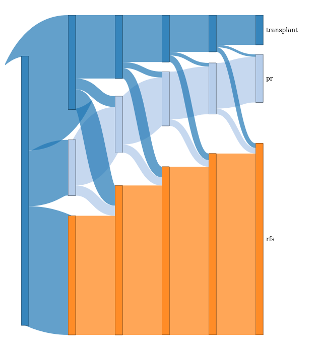

```{r setup, include = FALSE}
library(dplyr)
knitr::opts_chunk$set(
  collapse = TRUE,
  comment = "#>"
)
set.seed(17)  # For reproducibility's sake
```

```{r incmsu, eval=T}
library(multistateutils)
```

## Introduction

This vignette aims to provide a more thorough introduction to the features in `multistateutils` than the brief overview in the README. It uses the same example dataset and models, but has more examples and accompanying discussion.

## Example data

This guide assumes familiarity with multi-state modelling in R, this section in particular glosses over the details and just prepares models and data in order to demonstrate the features of `multistateutils`. If you are unfamiliar with multi-state modelling then I would recommend reading @dewreede or the [`mstate` tutorial by Putter](https://cran.r-project.org/package=mstate/vignettes/Tutorial.pdf).
 
For these examples the `ebmt3` data set from `mstate` will be used. This provides a simple illness-death model of patients following transplant. The initial state is patient having received transplantation, *pr* referring to platelet recovery (the 'illness'), with relapse-free-survival (*rfs*) being the only sink state.

```{r}
library(mstate)
data(ebmt3)
head(ebmt3)
```

`mstate` provides a host of utility functions for working with multi-state models. For example, the `trans.illdeath()` function provides the required transition matrix for this state structure (`transMat` should be used when greater flexibility is required).

```{r}
tmat <- trans.illdeath(c('transplant', 'pr', 'rfs'))
tmat
```

The final data preparation step is to form the data from a wide format (each row corresponding to a patient) to a long format, where each row represents a potential patient-transition. The `msprep` function from `mstate` handles this for us. We'll keep both the `age` and `dissub` covariates in this example.

```{r}
long <- msprep(time=c(NA, 'prtime', 'rfstime'), 
               status=c(NA, 'prstat', 'rfsstat'), 
               data=ebmt3, 
               trans=tmat, 
               keep=c('age', 'dissub'))
head(long)
```

Clock-reset Weibull models will be fitted to these 3 transitions, which are semi-Markov models. Simulation is therefore needed to obtain transition probabilities as the Kolmogorov forward differential equation is no longer valid with the violation of the Markov assumption. We are going to assume that the baseline hazard isn't proportional between transitions and there are no shared transition effects for simplicity's sake.

```{r}
library(flexsurv)
models <- lapply(1:3, function(i) {
    flexsurvreg(Surv(time, status) ~ age + dissub, data=long, dist='weibull')
})
```

## Estimating transition probabilities

Transition probabilities are defined as the probability of being in a state $j$ at a time $t$, given being in state $h$ at time $s$, as shown below where $X(t)$ gives the state an individual is in at $t$. This is all conditional on the individual parameterised by their covariates and history, which for this semi-Markov model only influences transition probabilities through state arrival times.

$$P_{h,j}(s, t) = \Pr(X(t) = j\ |\ X(s) = h)$$

We'll estimate the transition probabilities of an individual with the covariates `age=20-40` and `dissub=AML` at 1 year after transplant.

```{r}
newdata <- data.frame(age="20-40", dissub="AML")
```

The function that estimates transition probabilities is called `predict_transitions` and has a very similar interface to `flexsurv::pmatrix.simfs`. The parameters in the above equation have the following argument names:

  - $t$ - `times` (must be supplied)
  - $s$ - `start_times` (defaults to 0)
  - $h$ - not specified as the probabilities are calculated for all states
  - $j$ - not specified as the probabilities are calculated for all states
  
The code example below shows how to calculate transition probabilities for $t=365$ (1 year) with $s=0$; the transition probabilities for every state at 1 year after transplant given being in every state at transplant time. As with `pmatrix.simfs`, although all the probabilities for every pairwise combination of states are calculated, they are sometimes redundant. For example, $P_{h,j}(0, 365)$ where $h=j=\text{rfs}$ is hardly a useful prediction.

```{r example1}
predict_transitions(models, newdata, tmat, times=365)
```

Note that this gives very similar responses to `pmatrix.simfs`.

```{r example2}
pmatrix.simfs(models, tmat, newdata=newdata, t=365)
```

Confidence intervals can be constructed in the same fashion as `pmatrix.simfs`, using draws from the multivariate-normal distribution of the parameter estimates.

```{r example3}
predict_transitions(models, newdata, tmat, times=365, ci=TRUE, M=10)
```

Which gives rather different results to those obtained from `pmatrix.simfs` which seem to be too wide and the estimate value is far different to that obtained when run without CIs. I'm unsure why this is the case.

```{r example4}
pmatrix.simfs(models, tmat, newdata=newdata, t=365, ci=TRUE, M=9)
```

Note that on a single individual the speed-up isn't present, with `multistateutils` taking 4 times longer than `flexsurv`, although the difference between 1.2s and 0.3s isn't that noticeable in interactive work. The main benefit comes when estimating more involved probabilities, as will be demonstrated next.

```{r}
library(microbenchmark)
microbenchmark("multistateutils"=predict_transitions(models, newdata, tmat, times=365),
               "flexsurv"=pmatrix.simfs(models, tmat, newdata=newdata, t=365), times=10)
```

### Estimating probabilities at multiple times

Frequently, it is desirable to estimate transition probabilities at multiple values of $t$, in order to build up a picture of an individual's disease progression. `pmatrix.simfs` only allows a scalar for $t$, so estimating probabilities at multiple values requires manually iterating through the time-scale. In the example below we will calculate transition probabilities at yearly intervals for 9 years.

```{r example5}
predict_transitions(models, newdata, tmat, times=seq(9)*365)
```

In `pmatrix.simfs` it is up to the user to manipulate the output to make it interpretable. Again, the probabilities agree with each other.

```{r example6}
do.call('rbind', lapply(seq(9)*365, function(t) {
    pmatrix.simfs(models, tmat, newdata=newdata, t=t)
}))
```

By removing this boilerplate code, the speed increase starts to show, with the calculation of 8 additional time-points only increasing the runtime by 61% from 1.2s to 2s, while `flexsurv` has a twelve-fold increase from 0.3s to 3.7s.

```{r benchmarkmultipletimes}
microbenchmark("multistateutils"=predict_transitions(models, newdata, tmat, times=seq(9)*365),
               "flexsurv"={do.call('rbind', lapply(seq(9)*365, function(t) {
                            pmatrix.simfs(models, tmat, newdata=newdata, t=t)}))
               }, times=10)
```

### Changing start time

`pmatrix.simfs` limits the user to using $s=0$. In `predict_transitions` this is fully customisable. For example, the call below shows estimates the 1-year transition probabilities conditioned on the individual being alive at 6 months (technically it also calculates the transition probabilities conditioned on being dead at 6 months in the third row, but these aren't helpful). Notice how the probabilities of being dead at 1 year have decreased as a result.

```{r}
predict_transitions(models, newdata, tmat, times=365, start_times = 365/2)
```

Multiple values of $s$ can be provided, such as the quarterly predictions below.

```{r}
predict_transitions(models, newdata, tmat, times=365, 
                    start_times = c(0.25, 0.5, 0.75) * 365)
```

Finally, any combination of number of $s$ and $t$ can be specified provided that all $s$ are less than $min(t)$. 

```{r}
predict_transitions(models, newdata, tmat, times=seq(2)*365, 
                    start_times = c(0.25, 0.5, 0.75) * 365)
```

Note that obtaining these additional probabilities does not increase the runtime of the function.

```{r}
microbenchmark("time"=predict_transitions(models, newdata, tmat, 
                                          times=seq(2)*365, 
                                          start_times = c(0.25, 0.5, 0.75)*365),
               times=10)
```

### Multiple individuals

It's useful to be able to estimating transition probabilities for multiple individuals at once, for example to see how the outcomes differ for patients with different characteristics. `predict_transitions` simply handles multiple rows supplied to `newdata`.

```{r}
newdata_multi <- data.frame(age=c("20-40", ">40"), dissub=c("AML", "CML"))
```

```{r exampleinds1}
predict_transitions(models, newdata_multi, tmat, times=365)
```

As with multiple times, `pmatrix.simfs` only handles a single individual at a time.

```{r exampleinds2, error=T, eval=T}
pmatrix.simfs(models, tmat, newdata=newdata_multi, t=365)
```

And the user has to manually iterate through each new individual they would like to estimate transition probabilities for.

```{r exampleinds3}
do.call('rbind', lapply(seq(nrow(newdata_multi)), function(i) {
    pmatrix.simfs(models, tmat, newdata=newdata_multi[i, ], t=365)
}))
```

### Time-dependent covariates

The Markov assumption has already been violated by the use of a clock-reset time-scale, which is why we are using simulation in the first place. We can therefore add an other violation without it affecting our methodology. Owing to the use of clock-reset, the model does not take time-since-transplant into account for patients who have platelet recovery. This could be an important prognostic factor in that individual's survival. Similar scenarios are common in multi-state modelling, and are termed `state-arrival` times. We'll make a new set of models, where the transition from `pr` to `rfs` (transition 3) takes time-since-transplant into account. This information is already held in the `Tstart` variable produced by `msprep`.

```{r}
models_arrival <- lapply(1:3, function(i) {
    if (i == 3) {
        flexsurvreg(Surv(time, status) ~ age + dissub + Tstart, data=long, dist='weibull')
    } else {
        
        flexsurvreg(Surv(time, status) ~ age + dissub, data=long, dist='weibull')
    }
})
```

Looking at the coefficient for this variable and it does seem to be prognostic for time-to-rfs.

```{r}
models_arrival[[3]]
```

To estimate transition probabilities for models with state-arrival times, the variables needs to be included in `newdata` with an **initial value**, i.e. the value this variable has when the global clock is 0.

```{r}
newdata_arrival <- data.frame(age="20-40", dissub="AML", Tstart=0)
```

Then in `predict_transitions` simply specify which variables in `newdata` are time-dependent, that is they increment at each transition along with the current clock value. This is particularly useful for modelling patient age at each state entry, rather than at the starting state. Notice how this slightly changes the probability of being in *rfs* from a person starting in *transplant* compared to the example below that omits the `tcovs` argument. 

```{r}
predict_transitions(models_arrival, newdata_arrival, tmat, times=365, tcovs='Tstart')
```

```{r}
predict_transitions(models_arrival, newdata_arrival, tmat, times=365)
```

This functionality is implemented in `pmatrix.simfs`, but the `tcovs` argument actually has no impact on the transition probabilities, as evidenced below.

```{r tcovs1}
pmatrix.simfs(models_arrival, tmat, newdata=newdata_arrival, t=365, tcovs='Tstart')
```

```{r tcovs2}
pmatrix.simfs(models_arrival, tmat, newdata=newdata_arrival, t=365)
```

### Mixture of distributions

Sometimes greater flexibility in the model structure is required, so that every transition isn't obliged to use the same distribution. This could be useful if any transitions have few observations and would benefit from a simpler model such as an exponential, or if there is a requirement to use existing models from literature. Furthermore, if prediction is the goal, then it could be the case that allowing different distributions for each transition offers better overall fit.

An example is shown below, where each transition uses a different distribution family.

```{r}
models_mix <- lapply(1:3, function(i) {
    if (i == 1) {
        flexsurvreg(Surv(time, status) ~ age + dissub, data=long, dist='weibull')
    } else if (i == 2) {
        flexsurvreg(Surv(time, status) ~ age + dissub, data=long, dist='exp')
    } else {
        flexsurvreg(Surv(time, status) ~ age + dissub, data=long, dist='lnorm')
    }
})
```

`predict_transitions` handles these cases with no problems; currently the following distributions are supported:

  - Weibull
  - Gamma
  - Exponential
  - Log-normal
  - Log-logistic
  - Gompertz

```{r}
predict_transitions(models_mix, newdata, tmat, times=365)
```

`pmatrix.simfs` does not seem to function correctly under these situations.

```{r}
pmatrix.simfs(models_mix, tmat, newdata=newdata, t=365)
```

## Length of stay

Similarly, the length of stay functionality provided by `totlos.simfs` has also been extended to allow for estimates at multiple time-points, states, and individuals to be calculated at the same time. As shown below, the function parameters are very similar and the estimates are very close to those produced by `totlos.simf`.

```{r}
length_of_stay(models, 
               newdata=newdata,
               tmat, times=365.25*3,
               start_state='transplant')
```

```{r}
totlos.simfs(models, tmat, t=365.25*3, start=1, newdata=newdata)
```

Rather than provide a example for each argument like in the previous section, the code chunk below demonstrates that vectors can be provided to both `times` and `start`, and `newdata` accept a data frame with multiple rows.

```{r}
length_of_stay(models, 
               newdata=data.frame(age=c(">40", ">40"),
                                  dissub=c('CML', 'AML')),
               tmat, times=c(1, 3, 5)*365.25,
               start_state=c('transplant', 'pr'))
```

## State flow diagram

Another feature in `multistateutils` is a visualization of a predicted pathway through the state transition model, calculated using *dynamic prediction* and provided in the function `plot_predicted_pathway`. It estimates state occupancy probabilities at discrete time-points and displays the flow between them in the manner of a Sankey diagram. 

This visualization, an example of which is shown below for the 20-40 year old AML patient with biennial time-points, differs from traditional stacked line graph plots that only display estimates conditioned on a single time-point and starting state, i.e. a fixed $s$ and $h$ in the transition probability specification. `plot_predicted_pathway` instead displays dynamic predictions, where both $s$ and $h$ are allowed to vary and are updated at each time-point.

Note that the image below is actually an HTML widget and therefore **interactive** - try moving the states around. In the future I might try and implement a default optimal layout, along with explicitly displaying the time-scale.

$$P_{h,j}(s, t) = \Pr(X(t) = j\ |\ X(s) = h)$$

```{r, eval=F}
time_points <- seq(0, 10, by=2) * 365.25
plot_predicted_pathway(models, tmat, newdata, time_points, 1)
```



## Discrete event simulation

In addition to predicting an individual's progression through the statespace, we can also simulate an entire cohort's passage.
This is useful for situations where we have a heterogeneous group and are interested in obtaining estimates of measures such as the amount of time spent in each state for individuals with certain covariates.
A common use is in health economic modelling, where multi-state models are used to represent patient treatment pathways with costs associated with each treatment state.
The application of multi-state modelling in these contexts is often referred to as **discrete event simulation** and can be used to estimate the total number of patients receiving a certain treatment in a given timeframe, or survival rates of individuals with certain characteristics. 

The `cohort_simulation` function provides this functionality, and is specified very similarly to the other functions in this package, requiring:

  - a list of fitted `flexsurv` parametric models
  - a transition matrix of the same format used above
  - characteristics of individuals to be simulated stored in a data frame

```{r}
sim <- cohort_simulation(models, ebmt3, tmat)
```

The output is a long data frame where each row corresponds to an individual entering a new state.
The first rows below show that every individual enters the system in state 1 at time 0, which is the default behaviour.

```{r}
head(sim)
```

These initial conditions can be changed; for example, the `start_state` argument accepts either a single value representing the state that everyone enters in, or a vector of values with as many entries as there are observations in `newdata`. 
The simulation below evenly splits patients between starting in the initial state (*transplant*) and platelet recovery (state 2).

```{r}
sim2 <- cohort_simulation(models, ebmt3, tmat, 
                         start_state = sample(c(1, 2), nrow(ebmt3), replace=T))
head(sim2)
```

Likewise, the individuals don't have to enter the simulation at $t=0$.
The `start_time` parameter is specified in the same manner as `start_state`, accepting either a single value or a vector containing a time for each individual. 
The example below shows the case where individuals enter the system every 10 days, which means having a transplant in the `ebmt3` dataset we've been using.

```{r}
sim3 <- cohort_simulation(models, ebmt3, tmat, 
                         start_state = sample(c(1, 2), nrow(ebmt3), replace=T),
                         start_time = seq(0, 10*(nrow(ebmt3)-1), by=10))
head(sim3)
```

It is often useful to run a simulation over a set time-period; for example, if we are interested in looking at the cost to the health care provider from treating a particular disease over 10 years.
The `time_limit` argument allows for this use-case by terminating the simulation at the given time.

The model below uses the same incidence model of a transplant every ten days but now terminates at 10 years, which is reflected in the simulation output.

```{r}
sim4 <- cohort_simulation(models, ebmt3, tmat, 
                         start_state = sample(c(1, 2), nrow(ebmt3), replace=T),
                         start_time = seq(0, 10*(nrow(ebmt3)-1), by=10),
                         time_limit = 10*365.25)
tail(sim4)
```

## Old age mortality

One challenge with using simulation to obtain estimates is that it is possible to generate unrealistic situations, such as a person living for several hundred years, due to the use of unbounded probability distributions to model event times.

For example, in the output of the first cohort simulation from the previous section, the oldest patient dies `r sim %>% filter(state == 'rfs') %>% summarise(m=round(max(time)/365.25)) %>% pull(m)` years after the transplant!

```{r}
sim %>%
    arrange(desc(time)) %>%
    head()
```

To combat this, each of `prediction_transitions`, `length_of_stay`, and `cohort_simulation` allow the option to specify a hard limit after which a patient is considered dead, effectively placing bounds on the transition time distributions.

This is achieved through 3 arguments:

  - `agelimit`: This is either `FALSE`, in which case no limit is applied, or is a numeric value detailing the requested limit
  - `agecol`: The column in `newdata` that holds the patient age at entry to the simulation
  - `agescale`: Often, age is measured on a different time-scale to the rest of the study. For example, in many health studies age will be measured in years while study time will be recorded in months or days. This argument provides the scaling factor to be applied to the individual's age to place it on the same time-scale as the study. Defaults to 1.
  
The example below shows how to use this in practice.
Firstly, however, a dummy continuous age covariate needs to be added, as `ebmt3` only provides age groups.
Here we are saying that anyone is considered dead at the age of 100 (not 100 years after having the transplant).

```{r}
# Make dataset with age in
n_lt20 <- sum(ebmt3$age == '<=20')
n_gt20 <- sum(ebmt3$age == '20-40')
n_gt40 <- sum(ebmt3$age == '>40')
ebmt3$age_cont <- 0
ebmt3$age_cont[ebmt3$age == '<=20'] <- runif(n_lt20, 1, 20)
ebmt3$age_cont[ebmt3$age == '20-40'] <- runif(n_gt20, 21, 40)
ebmt3$age_cont[ebmt3$age == '>40'] <- runif(n_gt40, 40, 80)

sim5 <- cohort_simulation(models, ebmt3, tmat,
                          agelimit=36525, agecol='age_cont')
```

The maximum state entry time is now `r sim5 %>% top_n(1, time) %>% mutate(time=round(time/365.25)) %>% pull(time)` years, which means they died at the age of `r sim5 %>% top_n(1, time) %>% mutate(agedead = round((age_cont * 365.25 + time) / 365.25)) %>% pull(agedead)`, showing that the hard limit is working.

**NB: these arguments are also in the `predict_transitions` and `length_of_stay` functions, although they are less useful there.**

```{r}
sim5 %>%
    arrange(desc(time)) %>%
    head()
```

## `msrep2`

A large part of working with multi-state models involves converting raw data into a format suitable for transition-specific analysis.
The `mstate` package provides the `msprep` function to aid with this; it converts from a wide data frame where each row corresponds to a given individual, to a long based format where each row relates to a possible state transition (observed or not).

As an example using the same `ebmt3` dataset, we have the initial dataset in a wide format with:
  - a patient identifier (`id`) 
  - two possible states that can be entered, specified by entry time (`prtime` and `rfstime`) and entry indicator (`prstat`, `rfsstat`) 
  - individual level covariates (`dissub`, `age`, `drmatch`, `tcd`).

```{r}
head(ebmt3)
```

`msprep` then uses the transition matrix to form a data frame with each possible transition in the rows, for example, rows 1 and 2 reflect that individual 1 was in state 1 at time 0 and moved into state 2 at 23 days, thereby censoring the transition from 1->3 at the same timepoint.

```{r}
long <- msprep(time=c(NA, 'prtime', 'rfstime'), 
               status=c(NA, 'prstat', 'rfsstat'), 
               data=ebmt3, 
               trans=tmat, 
               keep=c('age', 'dissub'))
head(long)
```

This is a very useful function since it saves a lot of time munging the data and is used in every multi-state modelling related analysis I do.

However, it does have one slight limitation, in that the required wide format of the input data isn't necessarily a natural way of organising state entry data.
See @tidydata for a discussion of what makes data 'tidy', but in this situation the unit of observation is a state entry and so this is what should be recorded on the rows, not necessarily an individual.
Often I have to spend time converting from my raw data, where each row corresponds to a state entry, to this wide format before `msprep` can be used.
Furthermore, having one column per state means that this function doesn't allow for reversible Markov chains, where a person enters the same state more than once.

To address this, `multistateutils` provides an alternative version of `msprep` that accepts data in long format. 
This function, unimaginitivly called `msprep2`, requires a data frame with 3 columns: `id`, `state`, and `time`, so that each individual has as many rows as they have state entries. 

Let's show an example for the first 2 patients in `ebmt3`:

  - The first enters `pr` at time 23 and has last follow-up at $t=744$.
  - Patient 2 enters `rfs` at time 35 before entering `rfs` at $t=360$.

```{r}
ebmt3 %>% filter(id %in% 1:2)
```

In long format this is more straightforward and keeps the fields to a minimum, helping to focus on the states that actually are visited.

```{r}
entry <- data.frame(id=c(1, 2, 2),
                    state=c(2, 2, 3),
                    time=c(23, 35, 360))
entry
```

Passing this into `msprep2` produces an output that looks similar, but not identical to the one from `msprep`.
The discrepancy is in patient 1, as their right censored transition from state 2->3 is no longer included. 

```{r}
msprep2(entry, tmat)
```

Censored observations are included by means of supplying a data frame to the `censors` argument with fields: `id` and `censor_time`. 
Note that below we only add a value for patient 1, since we have complete follow-up on patient 2.

This is cleaner than `msprep` where all states that aren't visited need to have a censored observation time supplied, even if a patient has entered a sink state, while here only a single last follow-up time per patient is required. 

```{r}
cens <- data.frame(id=1, censor_time=744)
msprep2(entry, tmat, censors = cens)
```

The final difference from the `msprep` output is the lack of covaries.
Like with the censoring times, these are parameterised by a data frame indexed by `id`, with the remaining columns being any covariate of interest.

This method of supplying three separate tidy data frames for the state entry times, censor times, and covariates is consistent with how data is stored in relational databases and so should be familiar to most people already.

```{r}
covars <- ebmt3 %>% filter(id %in% 1:2) %>% select(id, age, dissub)
msprep2(entry, tmat, censors = cens, covars = covars)
```

An additional benefit of using a long data frame for state entries is that it allows reversible transitions.
As a quick demonstration, let us consider an extension of the illness-death model where a person can be cured, i.e. transition back from illness->healthy.

```{r}
states <- c('healthy', 'illness', 'death')
tmat2 <- matrix(c(NA, 3, NA, 1, NA, NA, 2, 4, NA), nrow=3, ncol=3, 
                dimnames=list(states, states))
tmat2
```

I'll generate two individuals:

  1. Moves from healthy->illness->death
  2. Moves from healthy->illness ,then recovers and goes back into healthy, before getting ill again and subsequently dying.

```{r}
multistate_entry <- data.frame(id=c(rep(1, 2),
                                    rep(2, 4)),
                               state=c('illness', 'death',
                                       'illness', 'healthy', 'illness', 'death'),
                               time=c(6, 11,
                                      7, 12, 17, 22))
multistate_entry
```

And as can be seen below, this works with `msprep2`.

```{r}
msprep2(multistate_entry, tmat2)
```


## References